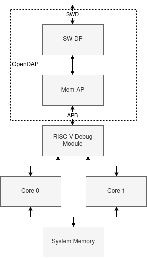

OpenDAP
=======

*OpenDAP is an early work-in-progress.*

OpenDAP is an implementation of a Debug Access Port (DAP), based on the ADIv5.2 specification, issue F. More specifically, it implements the following Debug Port (DP) and Access Port (AP) components:

- An SW-DP
	- Provides connection from an external Serial Wire Debug probe to one or more downstream APs
	- Implements a DPv2 with the MINDP extension (no transaction counter or pushed compare/verify)
	- Implements SWDv2 protocol, with multidrop support
- A Mem-AP
	- Provides further connection to downstream memory-mapped devices
	- Downstream interface is AMBA 3 APB

In the depicted example system, OpenDAP components provide a connection from an external SWD probe to a standard RISC-V Debug Module with an APB Debug Module Interface. This Debug Module can then debug multiple downstream RISC-V cores. In RISC-V terms, the OpenDAP components are functioning as a Debug Transport Module. This scheme is compliant with the RISC-V debug specification.

In this system, the RISC-V cores provide debugger access to system memory. An additional Mem-AP could be added to the DAP, to support direct memory access from the debugger without involving the RISC-V debug subsystem. Custom APs can also be added, for example to force the system clock tree into a known state and help diagnose issues where the core debug can't be accessed.

## Licensing

The contents of this repository is licensed under CC0 1.0 Universal, which is similar to a public domain dedication. I wrote all of the code in this repository with reference to the [ADIv5.2 specification](https://developer.arm.com/documentation/ihi0031/latest/) for my own education and better understanding of the specification. I hope that publishing this RTL will help others to understand parts of the specification that I struggled with.

Note that while this licence covers my own original Verilog source code, contained in this repository, it doesn't cover any underlying Arm intellectual property in ADIv5.2 or related Arm specifications. Seek legal advice, and ideally speak with your Arm handler, before deploying this RTL. Note also that I have no legal training, and the contents of this README does not constitute legal advice.

## TODO

* Consider using APB3 for DP->AP interface
